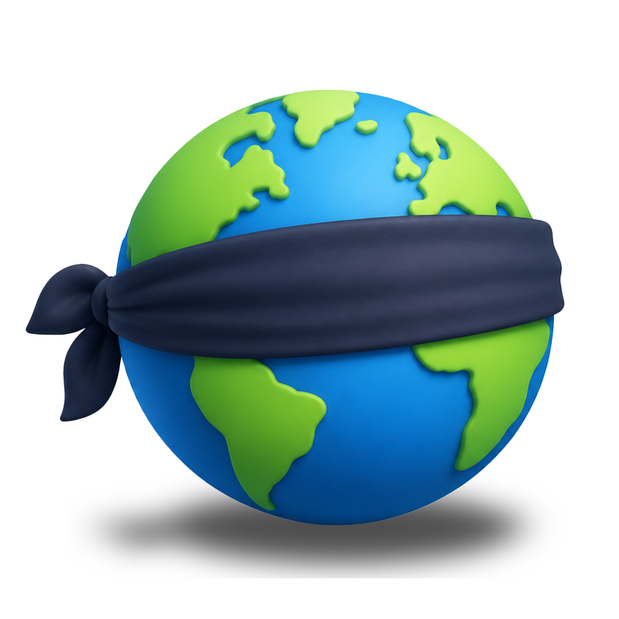
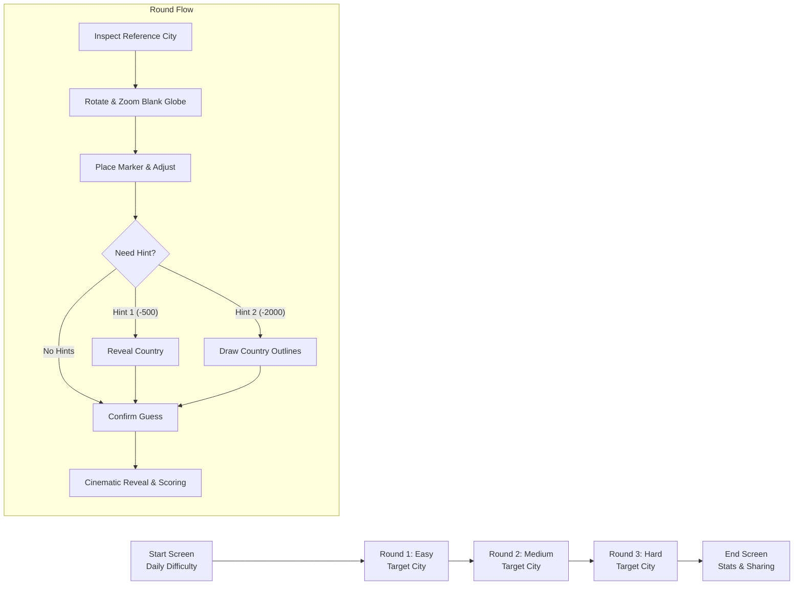

<div align="center">

  

  # Blind Globe

  **A daily 3D spatial geography challenge on an untextured world.**

  [](https://blindglobe.terpscoops.com)
  [](https://react.dev/)
  [](https://threejs.org/)
  [](https://www.typescriptlang.org/)
  [](https://vitejs.dev/)
  [](LICENSE)

  <p align="center">
    <a href="#about-the-game">About</a> •
    <a href="#gameplay--rules">Gameplay</a> •
    <a href="#mathematics--scoring">Scoring</a> •
    <a href="#architecture--tech-stack">Tech Stack</a> •
    <a href="#project-structure">Project Structure</a> •
    <a href="#getting-started">Getting Started</a> •
    <a href="#credits">Credits</a>
  </p>

</div>

---

## 🌍 About the Game

**Blind Globe** flips standard geography trivia on its head. Instead of identifying countries on marked 2D maps or shaded political atlases, players face a completely **blank, untextured 3D sphere** in deep space.

Each day brings a synchronized 3-round puzzle where players must pinpoint global cities using only:
1. **Latitude and Longitude Grid Lines** subtly etched on the globe surface.
2. **A Known Reference City** plotted in blue as an anchor point.
3. **Pure Spatial Intuition** and mental spherical geometry.

Once you lock in your guess, the blank globe bursts to life with high-resolution satellite imagery, a smooth cinematic camera glide, and precision distance measurement down to the kilometer.

---

## 🎮 Gameplay & Rules



### 1. The Daily Challenge
* **Deterministic Synchronized Seed:** Every player globally solves the exact same daily puzzle. Daily game seeds are anchored to Mountain Time (`America/Denver`) via multi-provider time APIs with deterministic PRNG shuffling.
* **Midnight MST Reset:** A live countdown timer tracks the remaining time until the next daily city rotation.

### 2. 3 Progressive Rounds
* **Round 1 (Easy):** Globally recognized mega-cities and world hubs (e.g., Tokyo, London, New York, Paris).
* **Round 2 (Medium):** Major continental hubs and regional capitals (e.g., Nairobi, Buenos Aires, Oslo, Denver).
* **Round 3 (Hard):** Remote islands, high-latitude outposts, and lesser-known settlements (e.g., Longyearbyen, Nuuk, Ushuaia, Easter Island).
* **Dynamic Difficulty Rating (1–10):** An animated gauge needle rates daily difficulty based on target city obscurity, reference city difficulty, and geodesic distance between the two points.

### 3. Placing Your Guess
* **Interactive Navigation:** Drag to orbit the 3D globe, scroll or pinch to zoom in and out.
* **Repositionable Pin:** Click or tap anywhere on the globe surface to set a temporary orange pin (`Confirm?`). You can reposition it as many times as you like before submitting.
* **Confirm:** Click **Confirm Guess** to trigger the reveal sequence.

### 4. Strategic Hint System
If you are lost on the blank globe, hints can help orient you at the cost of your round score:
* 💡 **Hint 1 (-500 points):** Reveals the country where the target city is located.
* 🗺️ **Hint 2 (-2,000 points):** Projects real GeoJSON international boundary outlines directly onto the blank sphere.

### 5. Multi-Phase Cinematic Reveal
When a guess is confirmed, an automated camera sequence takes over:
* **Phase 1:** Camera glides smoothly to your placed marker (red pin).
* **Phase 2:** An animated golden great-circle arc draws across the sphere from your guess to the actual location, while the real target scales up (green pin).
* **Phase 3:** The camera pulls back to a balanced perspective framing both pins simultaneously, while the globe switches to high-resolution Earth satellite imagery with atmospheric backlighting.

---

## 📐 Mathematics & Scoring

### Geodesic Distance (Haversine Formula)

The distance between the player's guess $(\phi_1, \lambda_1)$ and the target city $(\phi_2, \lambda_2)$ is computed using the spherical law of haversines:

$$\Delta\phi = \phi_2 - \phi_1, \quad \Delta\lambda = \lambda_2 - \lambda_1$$

$$a = \sin^2\left(\frac{\Delta\phi}{2}\right) + \cos(\phi_1)\cos(\phi_2)\sin^2\left(\frac{\Delta\lambda}{2}\right)$$

$$c = 2 \cdot \operatorname{atan2}\left(\sqrt{a}, \sqrt{1-a}\right)$$

$$d = R \cdot c$$

Where $R = 6{,}371\text{ km}$ (mean radius of the Earth).

### Score Calculation

Each round awards a maximum of **5,000 points** (up to **15,000 points** for a perfect 3-round game):

| Distance Error ($d$) | Base Score Formula | Reward Tier |
| :--- | :--- | :--- |
| **$d \le 50\text{ km}$** | **$5{,}000$ pts** (Bullseye!) | 🟢 Green Confetti Burst |
| **$50\text{ km} < d \le 5{,}050\text{ km}$** | $\max\left(0, \operatorname{round}\left(5{,}000 \cdot \left(1 - \frac{d - 50}{5{,}000}\right)\right)\right)$ | 🟡 Yellow / 🔴 Red Confetti |
| **$d > 5{,}050\text{ km}$** | **$0$ pts** | 🔴 Minimal Confetti |

$$\text{Net Round Score} = \max\left(0, \text{Base Score} - \text{Hint Penalties}\right)$$

### 3D Coordinate Mapping

To map geographic coordinates (Latitude, Longitude in degrees) to a 3D Cartesian vector on a unit sphere (radius $r = 1$):

$$\phi = (90^\circ - \text{lat}) \cdot \frac{\pi}{180^\circ}, \quad \theta = (\text{lng} + 180^\circ) \cdot \frac{\pi}{180^\circ}$$

$$x = -(\sin\phi \cdot \cos\theta) \cdot r$$

$$y = \cos\phi \cdot r$$

$$z = (\sin\phi \cdot \sin\theta) \cdot r$$

When clicking the globe, raycasting retrieves point $(x, y, z)$ on the sphere mesh and performs the inverse transformation to determine exact latitude and longitude coordinates.

---

## 🛠️ Architecture & Tech Stack

| Technology | Purpose | Implementation Details |
| :--- | :--- | :--- |
| **[React 18](https://react.dev/)** | UI & State Engine | Modern functional components, custom hooks, and concurrent features |
| **[Three.js](https://threejs.org/)** | WebGL Rendering | 3D sphere geometry, shaders, textures, raycasting, and lighting |
| **[@react-three/fiber](https://r3f.docs.pmnd.rs/)** | Declarative 3D Scene | React wrapper for Three.js render loop (`useFrame`), camera, and meshes |
| **[@react-three/drei](https://github.com/pmndrs/drei)** | 3D Helpers | OrbitControls, Starfield background, 3D Line primitives, HTML overlays |
| **[Zustand](https://github.com/pmndrs/zustand)** | State Management | Centralized store with `persist` middleware in browser `localStorage` |
| **[TypeScript](https://www.typescriptlang.org/)** | Type Safety | Strict interfaces for cities, GeoJSON features, and game state transitions |
| **[Vite](https://vitejs.dev/)** | Build Tool & Dev Server | Lightning-fast HMR and optimized chunk splitting (`three`, `vendor`, `ui`) |
| **[seedrandom](https://github.com/davidbau/seedrandom)** | Deterministic PRNG | Cross-browser identical Fisher-Yates shuffle using daily date strings |
| **[Lucide React](https://lucide.dev/)** | Icons | Crisp, modern icons for HUD, hints, tutorials, and social sharing |
| **[canvas-confetti](https://www.kirilv.com/canvas-confetti/)** | Particle FX | Dynamic confetti bursts on successful guesses and game completion |

### 3D Lighting & Scene Environment
* **Multi-Point Lighting:** Ambient fill light, primary key light, sky-blue/indigo hemisphere light, and rim backlighting (`#6366f1`) for deep contrast.
* **Atmosphere Shell:** An outer translucent geometry sphere (`args={[1.06, 64, 64]}`) providing subtle atmospheric glow around the globe limb.
* **Deep Space Stars:** 6,000 animated twinkling background stars rendered via `@react-three/drei`.

---

## 📁 Project Structure

```text
blind-globe/
├── public/
│   ├── blindglobe.png              # Primary branding badge with dark background
│   ├── blindglobe-nobg.png         # Transparent logo icon for UI windows & badges
│   ├── favicon.ico                 # Multi-resolution favicons
│   ├── favicon-16x16.png
│   ├── favicon-32x32.png
│   ├── apple-touch-icon.png
│   └── android-chrome-*.png
├── src/
│   ├── components/
│   │   ├── Globe/
│   │   │   ├── GlobeScene.tsx      # R3F Canvas setup, lighting, stars, atmosphere
│   │   │   ├── GameGlobe.tsx       # Core 3D globe: textures, grid, GeoJSON, animations
│   │   │   ├── CameraController.tsx# Smooth camera positioning & focus tracking
│   │   │   └── Pin.tsx             # 3D location pin markers with surface glow & labels
│   │   ├── DifficultyMeter.tsx     # Animated SVG gauge with needle rotation
│   │   ├── DifficultyMeter.css     # Styles for difficulty gauge & mobile tooltips
│   │   ├── EndScreenUI.tsx         # Game Over summary, stats, countdown, and sharing
│   │   ├── GameUI.tsx              # In-game HUD: round indicator, target box, hints, cards
│   │   ├── StartScreenUI.tsx       # Welcome screen, all-time stats, and play button
│   │   ├── TutorialOverlay.tsx     # 6-step modal tutorial with interactive simulation
│   │   └── Tutorial.css            # Styles and keyframes for tutorial animations
│   ├── data/
│   │   ├── cities.ts               # Curated database of global cities with difficulty tiers
│   │   └── world-countries.json    # GeoJSON international border coordinates
│   ├── store/
│   │   └── gameStore.ts            # Zustand store (state, actions, localStorage persistence)
│   ├── utils/
│   │   ├── dailySeed.ts            # Time API fetcher and seeded Fisher-Yates shuffle
│   │   ├── distance.ts             # Haversine distance calculation utility
│   │   └── math.ts                 # Spherical to 3D Cartesian coordinate conversion
│   ├── App.tsx                     # Main application layout wrapper
│   ├── index.css                   # Global design system, glassmorphism, responsive styles
│   └── main.tsx                    # React application root entrypoint
├── index.html                      # HTML template with Google Fonts & Google Analytics
├── package.json                    # Dependencies and scripts
├── tsconfig.json                   # TypeScript configuration
└── vite.config.ts                  # Vite config with optimized manual vendor chunking
```

---

## 🚀 Getting Started

### Prerequisites
* **[Node.js](https://nodejs.org/)** (v18.0.0 or higher recommended)
* **npm** or **pnpm** or **yarn**

### Installation

1. **Clone the repository:**
   ```bash
   git clone https://github.com/SoyMilkIsOk/blind-globe.git
   cd blind-globe
   ```

2. **Install dependencies:**
   ```bash
   npm install
   ```

3. **Start the local development server:**
   ```bash
   npm run dev
   ```
   Open [http://localhost:5173](http://localhost:5173) in your browser to play!

### Build for Production

To create an optimized, minified production build:

```bash
npm run build
```

To preview the built production bundle locally:

```bash
npm run preview
```

---

## 🌐 Network & Time Synchronization

To ensure game fairness and prevent client-side clock manipulation:
1. When `initGame()` is called, the app queries `https://timeapi.io` for the current date in the `America/Denver` timezone.
2. If `timeapi.io` is unreachable, it automatically fails over to `https://worldtimeapi.org`.
3. If all external APIs are unreachable (offline or network outage), the game displays a clear **Connection Error** screen with a retry button to prevent mismatched city puzzles.

---

## 📱 Mobile & Responsive Support

Blind Globe is optimized for all form factors:
* **Dynamic FOV & Zoom Distance:** Camera distance scales from `2.5` on desktop to `3.5` on mobile viewports.
* **Vertical Camera Offsetting:** When revealing scores, the camera pans the target coordinates upward so bottom HUD cards never obstruct your pins.
* **Touch-Friendly Controls:** Fully supports single-finger drag to rotate and two-finger pinch to zoom.
* **Adaptive HUD:** Collapses secondary indicators and centers action buttons for one-handed smartphone play.

---

## 🤝 Contributing

Contributions, bug reports, and suggestions are welcome!
1. Fork the repository.
2. Create a feature branch (`git checkout -b feature/amazing-feature`).
3. Commit your changes (`git commit -m 'feat: add amazing feature'`).
4. Push to the branch (`git push origin feature/amazing-feature`).
5. Open a Pull Request.

---

## 📄 License

This project is licensed under the **MIT License** - see the [LICENSE](LICENSE) file for details.

---

## 👏 Credits & Acknowledgements

* **Earth Textures:** NASA Visible Earth / Three.js planet asset library.
* **Country Boundaries:** Natural Earth public domain GeoJSON vectors.
* **Icons:** [Lucide React](https://lucide.dev/).
* Built and maintained with ❤️ by [Terpmetrix](https://github.com/SoyMilkIsOk).
